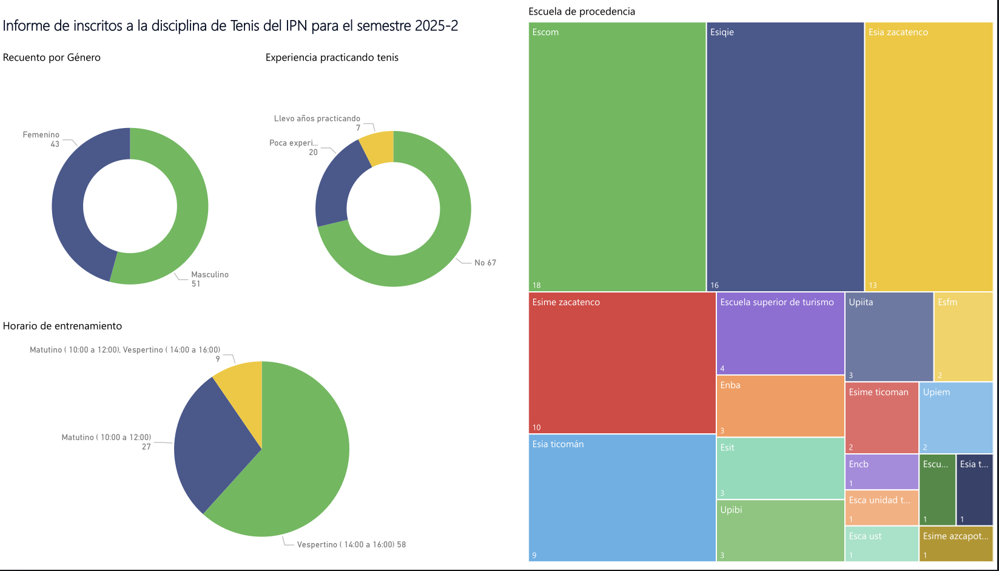

# TennisIPNDataAnalysis

This project aims to cleanse, transform, and perform exploratory analysis of a dataset collected through a registration form for players interested in participating in the tennis discipline of the "Instituto Politecnico Nacional" (IPN). The form collects personal, academic, and athletic information from participants, including experience in the sport, available schedules, and contact information.

Objectives

- Determine the total number of those interested in registering
- Count the registered players by gender
- Group players by experience (No experience, Experience)
- Determine how many players can train at each time slot

Tools Used

- Python
- Spyder (IDE)
- Excel
- Power BI (Data Visualization)

 Results

The Power BI report(IPN20252.pdf) yielding the following results:

- A total of 94 participants were registered.
- 51 registrations were male and 43 female.
- Only 27 of those registered had any experience in the sport.
- The training time with the highest number of players was in the evening (58 registered).
- The schools with the highest number of enrollments were: 1- ESCOM , 2 . ESIQIE , 3. ESIA Zacatenco, 4. ESIME Zacatenco 

